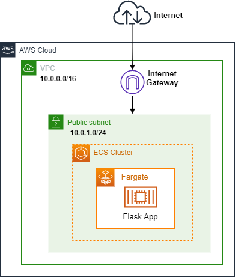
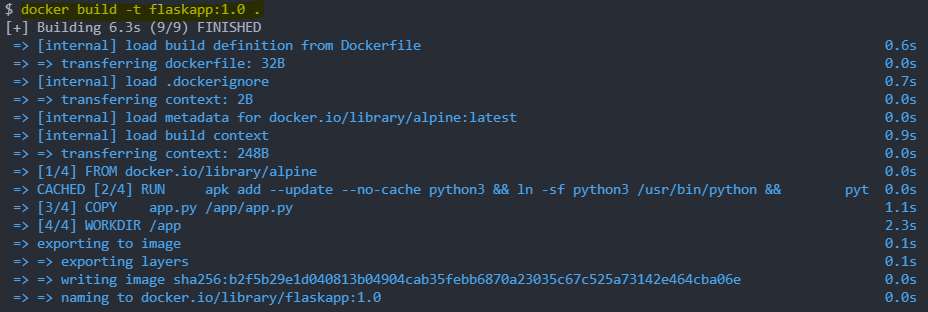
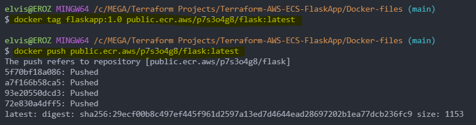
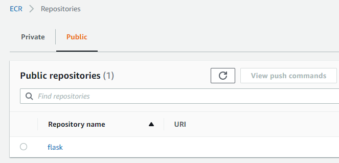
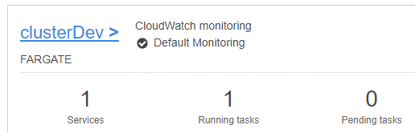
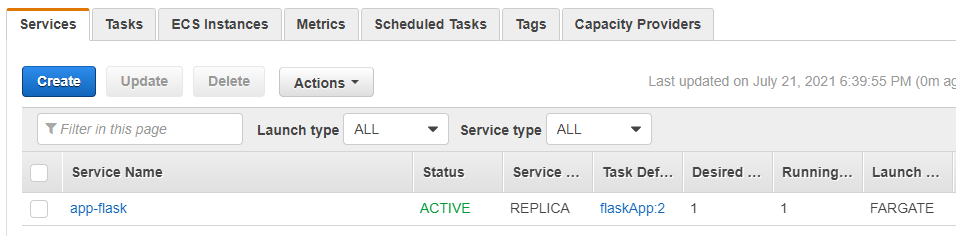
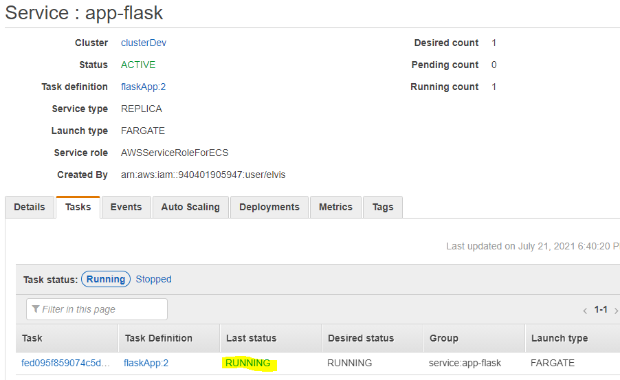
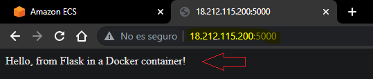

# Terraform - AWS ECS Fargate FlaskApp

## Descripcion
- Se plantea el lanzamiento de una aplicacion hecha en Flask en un contenedor utilizando ECS y Fargate
- Se crea una imagen docker que contenga la aplicacion Flask y se la sube a un repositorio publico en ECR
- Luego se crea un cluster y se crea un servicio para correr nuestras tareas
- Finalmente se lanza la tarea y se comprueba el funcionamiento de nuestro contenedor

## Arquitectura

La Arquitectura esta diseñada e implementada en 1 AZ y consta de los siguientes recursos:

- 1 Internet Gateway
- 1 Subnet publica
- 1 Cluster en ECS



## Build Docker Image

Programamos nuestra aplicacion Flask

```t
from flask import Flask
app = Flask(__name__)

@app.route('/')
def hello_world():
    return 'Hello, from Flask in a Docker container!'


if __name__ == '__main__':
    app.run(debug=True, host='0.0.0.0')
```

Creamos nuestro Dockerfile
- Se utiliza una imagen de Alpine
- Se instala todas las dependencias para `Python`

```t
FROM    alpine
RUN     apk add --update --no-cache python3 && ln -sf python3 /usr/bin/python &&\
        python3 -m ensurepip                                                  &&\
        pip3 install --no-cache --upgrade pip setuptools                      &&\
        pip3 install flask
COPY    app.py /app/app.py
WORKDIR /app
EXPOSE  5000
ENTRYPOINT [ "python" ]
CMD     [ "app.py" ]
```
Construimos nuestra imagen docker


Tageamos nuestra imagen para subirla a nuestro repositorio en ECR

Luego subimos esa imagen a nuestro repositorio





# Archivos Terraform
## 01 - vars Vpc
```t
variable "cidr" {
  type = string
  default = "10.0.0.0/16"
}

variable "azs" {
  type = string
  default = "us-east-1a"
}

variable "subnet-ip" {
  type = string
  default = "10.0.1.0/24"
}
```

## 02 - Vpc
```t
resource "aws_vpc" "ecs-vpc" {
  cidr_block = "${var.cidr}"

  tags = {
    Name = "ecs-vpc"
  }
}
```

## 03 - Subnet
```t
resource "aws_subnet" "pub-subnet" {
  vpc_id            = "${aws_vpc.ecs-vpc.id}"
  availability_zone = "${var.azs}"
  cidr_block        = "${var.subnet-ip}"
  map_public_ip_on_launch = true

  tags = {
    Name = "pub-subnet"
  }
}
```


## 04 - Security Groups
```t
resource "aws_security_group" "sg1" {
  name        = "flaskapp"
  description = "Port 5000"
  vpc_id      = aws_vpc.ecs-vpc.id

  ingress {
    description      = "Allow Port 5000"
    from_port        = 5000
    to_port          = 5000
    protocol         = "tcp"
    cidr_blocks      = ["0.0.0.0/0"]
    ipv6_cidr_blocks = ["::/0"]
  }

  egress {
    description = "Allow all ip and ports outboun"
    from_port   = 0
    to_port     = 0
    protocol    = "-1"
    cidr_blocks = ["0.0.0.0/0"]
  }
}
```

## 05 - Internet Gateway
```t
resource "aws_internet_gateway" "i-gtwy" {
  vpc_id = "${aws_vpc.ecs-vpc.id}"

  tags = {
    Name = "ecs-i-gateway"
  }
}
```

## 06 - Route Tables
```t
resource "aws_route_table" "pub-table" {
  vpc_id    = "${aws_vpc.ecs-vpc.id}"
}

resource "aws_route" "pub-route" {
  route_table_id         = "${aws_route_table.pub-table.id}"
  destination_cidr_block = "0.0.0.0/0"
  gateway_id             = "${aws_internet_gateway.i-gtwy.id }"
}

resource "aws_route_table_association" "as-pub" {
  route_table_id = "${aws_route_table.pub-table.id}"
  subnet_id      = "${aws_subnet.pub-subnet.id}"  
}
```

## 07 - ECS Cluster
```t
resource "aws_ecs_cluster" "ecs-cluster" {
  name = "clusterDev"  
}
```

## 08 - Task definition
```t
resource "aws_ecs_task_definition" "task" {
  family                    = "flaskApp"
  network_mode              = "awsvpc"
  requires_compatibilities  = [ "FARGATE" ]
  cpu                       = 256
  memory                    = 512

  container_definitions = jsonencode([
    {
        name            = "flask-app"
        image           = "public.ecr.aws/p7s3o4g8/flask:latest" #URI
        cpu             = 256
        memory          = 512
       
    }
  ])
}
```

## 09 - ECS Service

```t 
resource "aws_ecs_service" "svc" {
  name              = "app-flask"
  cluster           = "${aws_ecs_cluster.ecs-cluster.id}"
  task_definition   = "${aws_ecs_task_definition.task.id}"
  desired_count     = 1
  launch_type       = "FARGATE"

  
  network_configuration {
    subnets          = [ "${aws_subnet.pub-subnet.id}" ]
    security_groups  = [ "${aws_security_group.sg1.id}" ]
    assign_public_ip = true
  }
}
```

##  Uso

```t
terraform init
terraform validate
terraform plan
terraform apply -auto-approve
```

# Resultados

- Una vez creada la infraestrutura, nos dirigimos a ECS y comprobamos si se ha creado nuestro cluster



- Miramos si se ha creado nuestro `Service`



- Ingresamos a ese `Service`, para comprobar si se esta corriendo nuestra tarea




- Si el estado de nuestra tarea tiene como `Last Status` `RUNNING`, nuestro contenedor esta listo y funcionando
- Utilizamos la `IP Publica` que se le asigna a la tarea para comprobar el funcionamiento
- Para esto colocamos en la barra de direcciones la ip publica, seguido del puerto `5000`
- `<public_ip>:5000`



